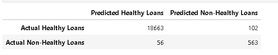

# credit-risk-classification

##CREDIT RISK ANALYSIS REPORT

Overview

This analysis trains and evaluates a model based on loan risk by creating a logistic regression model, splitting the data,
then creating a confusion matrix and classification report to determine precision of classification.

The data comes from a .csv file containing seventy-seven thousand rows of data of different loan sizes, interest rate, borrower income,
debt-to-income ratio, number of accounts,derogatory marks,total debt incurred by the borrower, and loan status. This model was created in hopes of 
accurately predicting if a loan was healthy, or high-risk, which was pre-labeled in the data as 0(healthy) or 1(high-risk) under the 'loan_status' column.

The data was first loaded from the CSV to a DataFrame. The 'loan_status' column was then separated from the DataFrame and assigned as the 'y' variable 
for training and testing the data. The rest of the columns were assigned to the 'X' variable.

The data was then split, using sklearn's 'train_test_split' method, and also assigned a random state of 1, ensuring folds of cross-validation to be independent
of each other. From this split was created the training and testing data which are: X_train, X_test, y_train, y_test.

A logistic regression model was then instantiated, assigned with a random state of 1, before being fitted with the training data
produced from the train_test_split method, which were X_train and y_train.

A prediction was then made using the previously created model, assigning the 'X_test' data to be classified.

A confusion matrix and classification report for the model was then generated and printed to evaluate the model.

Results

Logistic Regression Model:
-In the image healthy loans(0) are accurately classified 100% of the time, compared to high-risk loans(1) which only were classified correctly
85% of the time. 
-The precision for classifying healthy loans was 100% while its' recall is 99%, indicating high accuracy for precision, and completeness for recall.
-The precision for classifying high-risk loans are 85%, while its' recall is 91%. Although this still indicates high accuracy and completeness,
it is considered subpar compared to the scores of healthy loans.

Summary

Since from the data there are more healthy loans than not, it can be inferred that most of the borrowers or customers of the company have a healthy income, which is why a model that classifies healthy loans correctly for creditworthiness would be better for the company.

The model produced accurately classifies healthy loans 99% of the time, and high-risk loans 85% of the time. In order to improve the precision and recall for classifying non-healthy loans, I would recommend the company acquire more datapoints in order to increase the model accuracy for classifying them. This is because in the generated confusion matrix, it can be seen that out of 619 non-healthy loans, 56 were misclassified by the model as healthy loans.

On the other hand, the healthy loans were classified correctly 99% of the time, only predicting wrongly 102 of the 18765 as non-healthy.

Still, this model ensures that the creditworthiness of borrowers with healthy loans are classified correctly, and that borrowers with high-risk loans are rightfully classified most of the time. This model's accuracy for classifying non-healthy loans could also be improved by increasing the amount of data for non-healthy loans, of which a company would be able to provide more as time goes by.